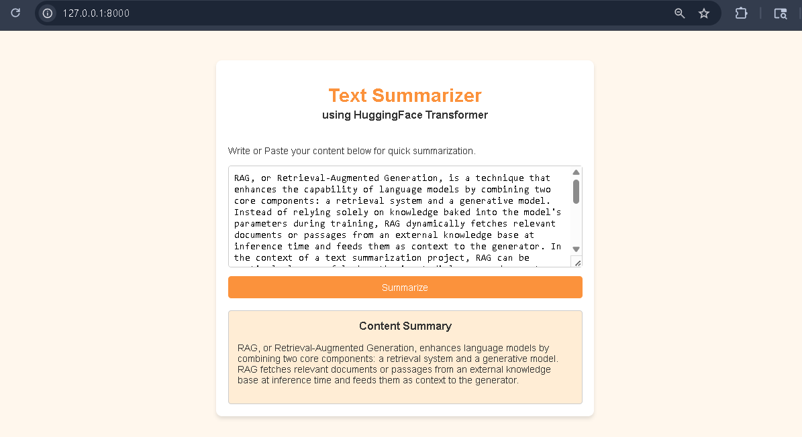

# Text Summarizer

A dialogue summarization web app that takes long text or conversation as input and generates a concise summary using a fine-tuned T5 transformer model served through a Flask web interface.



---

## About the Project

This project fine-tunes a **T5-small** model from HuggingFace Transformers on a dataset of **14,000 dialogue samples** to perform abstractive text summarization. Users can paste any text or conversation into the web UI and get a clean, shortened summary in seconds.

The app runs entirely locally — no external API calls, no internet required after setup.

### What it does

- Accepts raw text or dialogue as input
- Preprocesses and tokenizes the input using the T5 tokenizer
- Runs inference through the fine-tuned model
- Returns a concise abstractive summary in the UI

### Tech Stack

| Layer | Technology |
|---|---|
| Model | T5-small (HuggingFace Transformers) |
| Training Data | 14,000 dialogue samples |
| Backend | Python, Flask |
| Frontend | HTML, CSS, JavaScript |
| Device Support | CUDA · Apple MPS · CPU (auto-detected) |

---

## Project Structure

```
├── 📁 data
│   ├── 📁 processed
│   └── 📁 raw
│       ├── 📄 train_dataset.csv
│       └── 📄 validation_dataset.csv
├── 📁 model
│   ├── 📁 saved_summary_model
│   │   ├── ⚙️ config.json
│   │   ├── ⚙️ generation_config.json
│   │   ├── 📄 model.safetensors
│   │   ├── ⚙️ tokenizer.json
│   │   └── ⚙️ tokenizer_config.json
│   └── 🐍 train.py
├── 📁 notebooks
│   └── 📄 text_summarizer.ipynb
├── 📁 static
│   ├── 📁 css
│   │   └── 🎨 style.css
│   ├── 📁 images
│   │   └── 🖼️ Demo project image.png
│   └── 📁 js
│       └── 📄 script.js
├── 📁 templates
│   └── 🌐 index.html
├── 📝 README.md
├── 🐍 app.py
└── 📄 requirements.txt
```

---

## Getting Started

### Prerequisites

- Python 3.8 or higher
- pip

### Step 1 — Clone the repository

```bash
git clone https://github.com/kiran-444/Transformer-based-Text-Summarization-Systemt
cd Transformer-based-Text-Summarization-Systemt
```

### Step 2 — Set up the environment

```bash
python -m venv .venv

# Mac / Linux
source .venv/bin/activate

# Windows
.venv\Scripts\activate

pip install -r requirements.txt
```

### Step 3 — Train the model

This script handles everything: data loading, preprocessing, fine-tuning T5-small on 14,000 dialogue samples, and saving the model.

```bash
python model/train.py
```

> Training may take several minutes depending on your hardware.
> GPU (CUDA or Apple MPS) is used automatically if available, otherwise falls back to CPU.

Once complete, the trained model is saved to `model/saved_summary_model/`.

### Step 4 — Run the app

```bash
python app.py
```

Open your browser and visit:

```
http://localhost:8000
```

Paste any text into the input box and click **Summarize**.